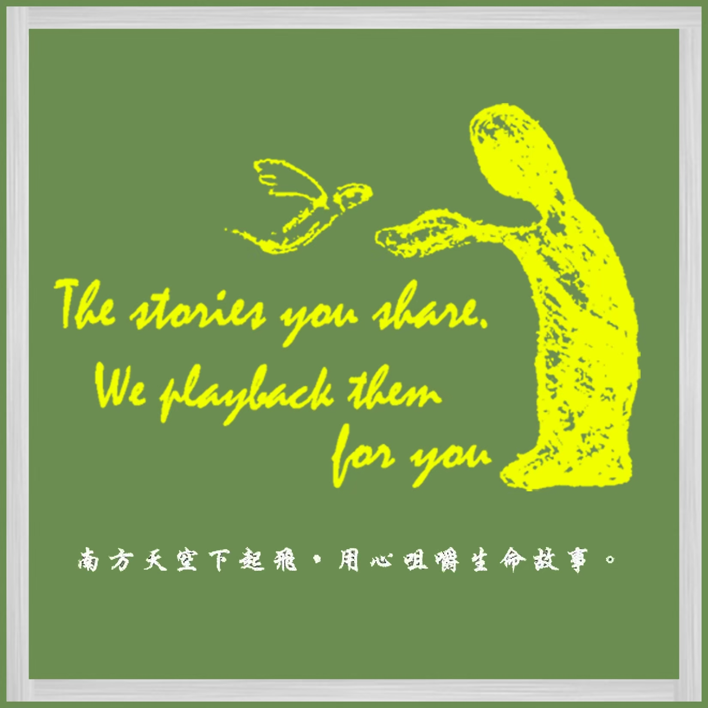
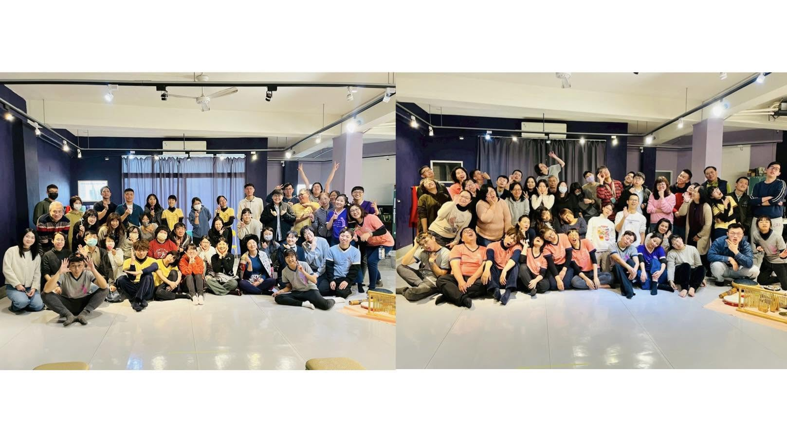
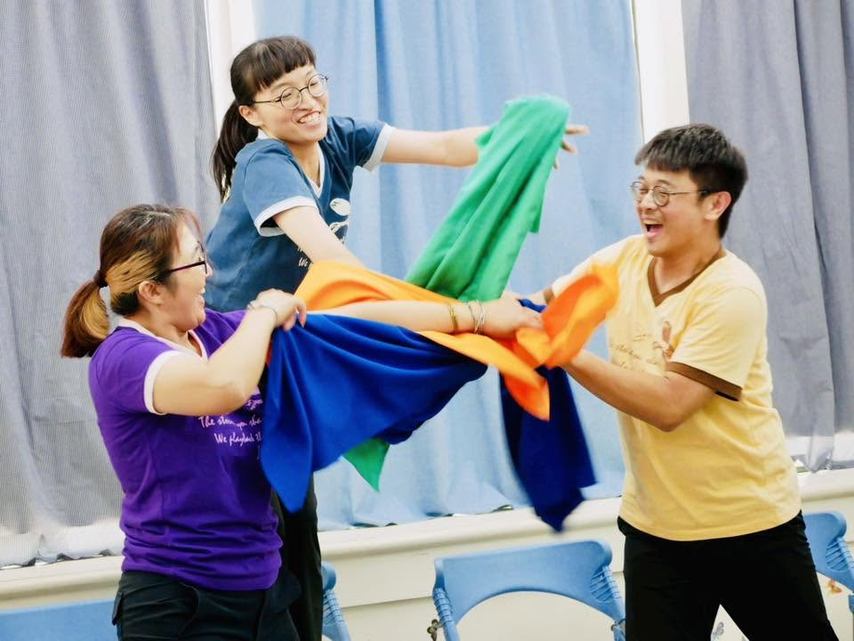
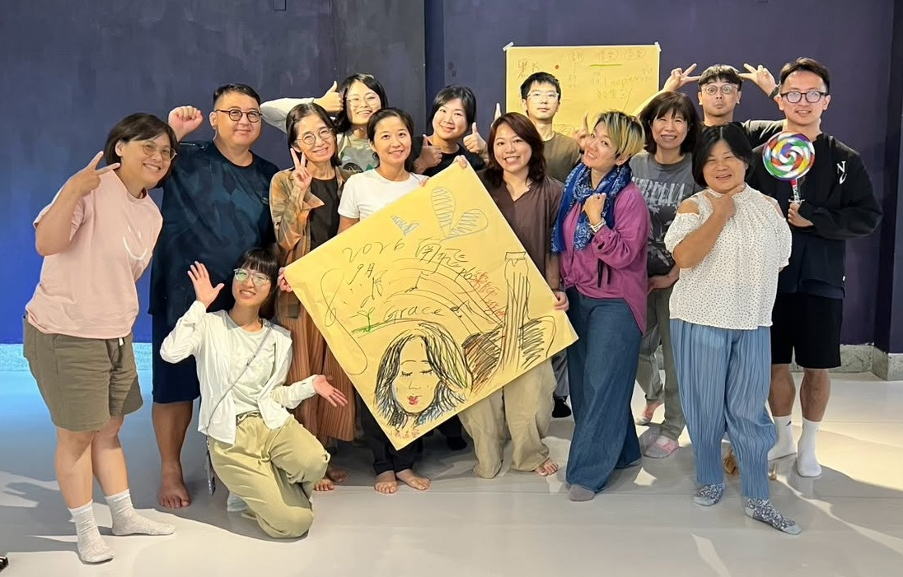

+++
title = "關於我們"
featured_image = "/img/home.jpg"
description = "在南方天空下起飛的一人一故事劇團"
+++

---------

♬ 南飛．嚼事一人一故事劇團 ♬

{width="60%"}

## 🎭 什麼是一人一故事劇場？

一人一故事劇場是一種以即興表演、音樂和觀眾敘說共創的表演型式。

在這場演出中，我們將邀請觀眾分享自己的故事，眾人們的故事將成為表演的靈感，由演員團隊即興演繹，回送給說故事人及在場的參與者。

## 💬 關於南飛．嚼事

南飛．嚼事成團緣起於2007年臺南大學社區劇場專題課程，在為期一學年的一人一故事劇場培訓中，夥伴們有感於課程中貼近人心、真實演繹的感動，遂成立劇團來持續學習、一起成長。

南飛．嚼事成立宗旨為「在南方天空下起飛的一人一故事劇團，我們將用心咀嚼每個人的生命故事。」而團名重組後的諧音「絕非難事」，也代表當初創團的信心。

## 🎶 售票演出與邀演

*2026高雄天使心演出*

除了每年皆會進行一次年度售票演出外，也因應非營利單位、文教基金會的邀請從事公益演出，活躍於其他場域（學校、社區劇場、相關應用劇場...等）。如有需要，也歡迎與我們接洽合作哦！

## ⭐ 課程與活動

*2026樂師工作坊課後合照*

我們也會舉辦一人一故事相關課程與開放團練，和大家一起學習。如有意願參與、獲得最新課程資訊，請追蹤我們的粉專！

