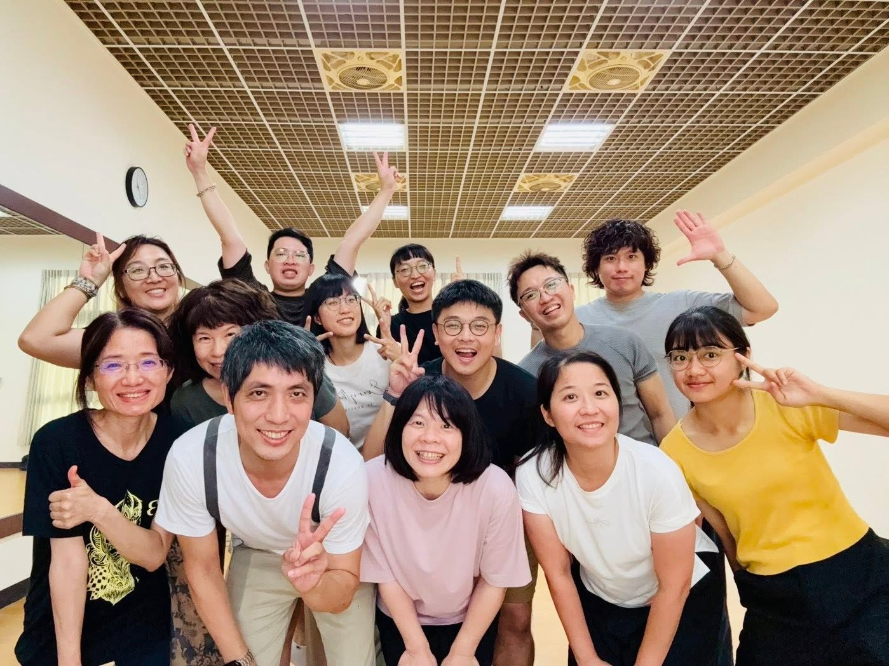
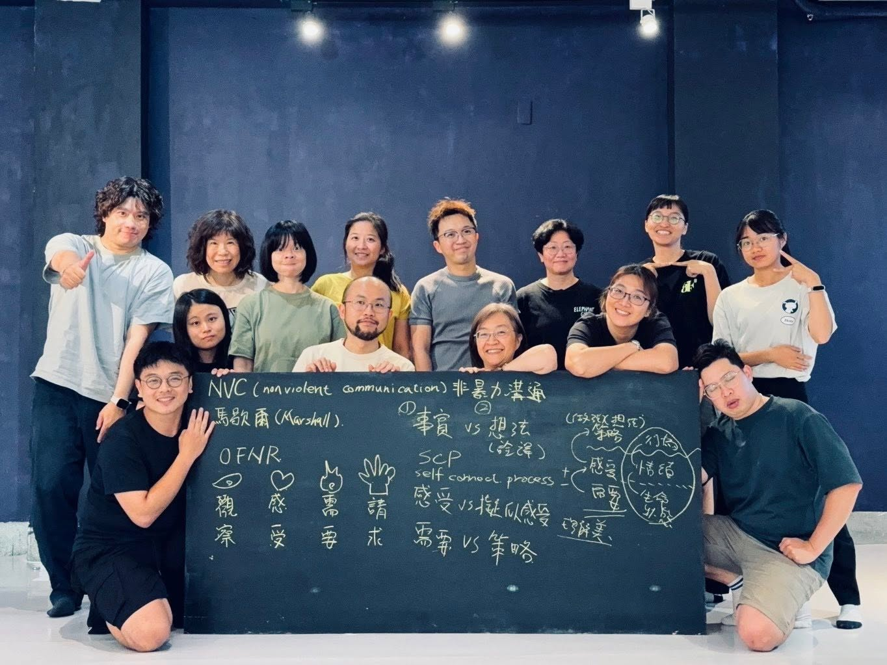
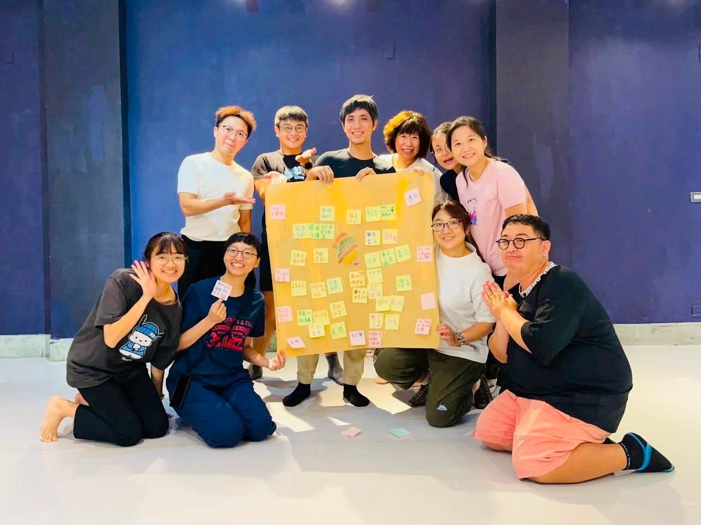

+++
date = '2026-07-05'
draft = false
title = "2026 一人一故事劇場 X 非暴力溝通工作坊"
private = true
keywords = ["一人一故事", "非暴力溝通", "NVC", "政治", "台南"]
categories= ["課程"]
tags = ["非暴力溝通"]
omit_header_text= false
featured_image = "202605_nvc_g.jpg"
+++

在小伃老師的邀請下，我們參與了台北悅萃坊的合作協同計畫《應用一人一故事劇場於政治對話》，並在演出前進行了兩場非暴力溝通（NVC）培訓。

感謝志軒、阿德與小伃老師特地南下，帶領在南部的我們進入非暴力溝通（NVC）的學習。

<!--more-->

課程的第一場次中，我們學習如何何運用物件作為角色，讓舞台上的情感與立場有更多層次。也透過角色之間的互動，看見故事中的關聯或對比，以及演出中彼此牽動的力量。

*第一場次結束後的大合照*

在第二場次，我們則從非暴力溝通的理論開始，學習非暴力溝通中的觀察(O)、感受(F)、需求(D)、請求(R)，練習分辨事實與詮釋，還有看見彼此真正的需求。

*第二場次結束後的大合照*

在演出前，也謝謝志軒再一次南下來與我們共同團練，教我們如何活用之前學到的技巧，為計劃演出做準備。

*演出前的準備*

在這些課程中，我們從彼此的分享，體會到政治的觀點的差異反映了個人各自獨特的生命經驗，背後也有著彼此的情緒感受和需要。

也期許這些課程的經驗，能讓我們在之後的演出更自然地接受衝突，學習如何傾聽，讓我們的演出，可以是一個能承接差異與情緒的空間。

