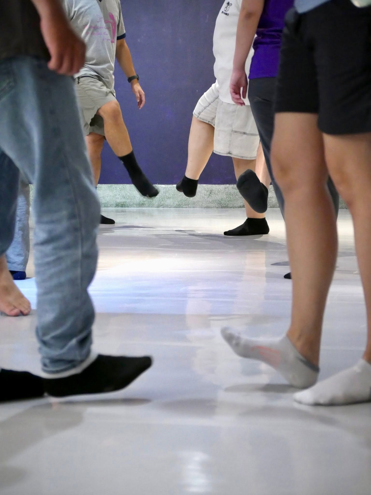
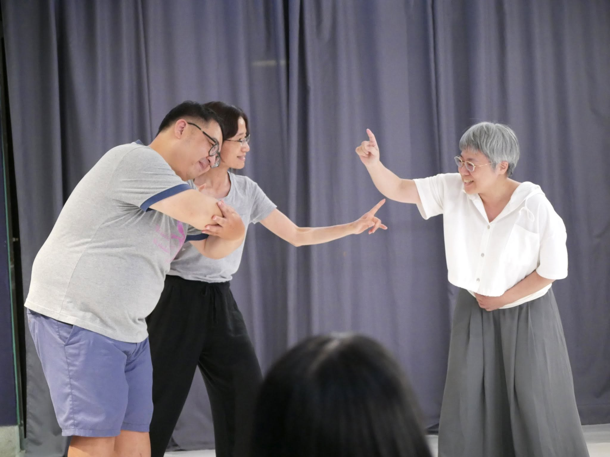
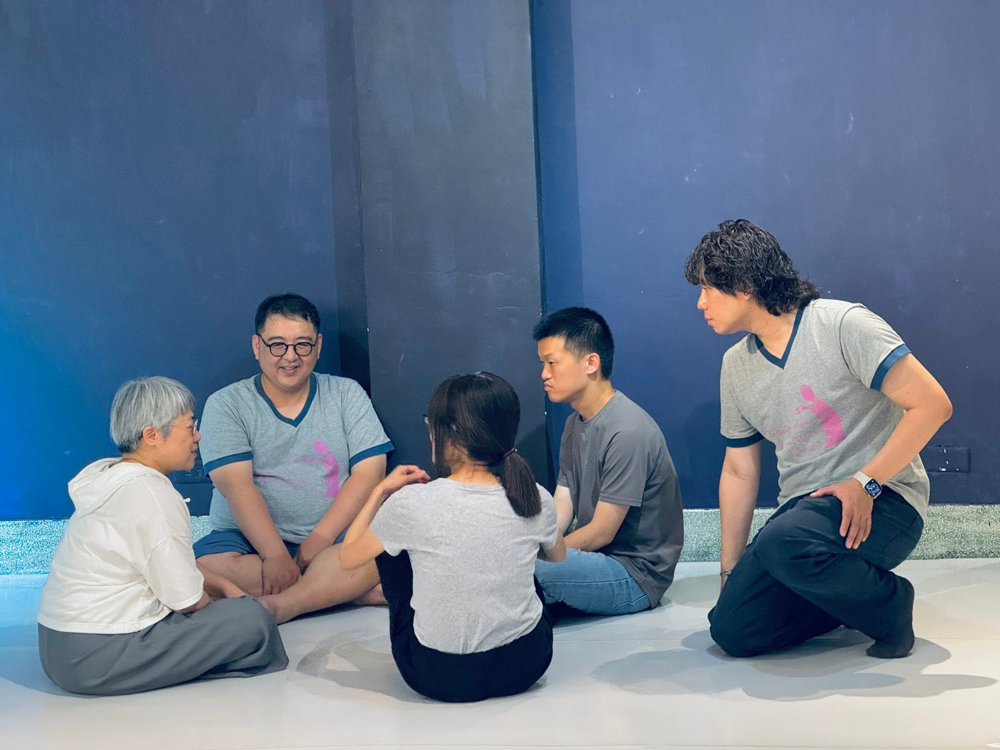
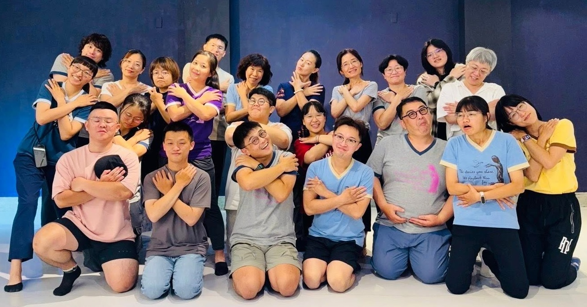

+++
date = '2026-05-16'
draft = false
title = '《生理期》開放團練'
private = true
categories= ["活動紀錄"]
tags = ["開放團練"]
omit_header_text= false
featured_image = "group_all.jpg"
+++

在這次的活動中，我們共有十二位劇團夥伴，以及十位報名參與的朋友。透過一系列循序漸進的劇場活動，慢慢找到自己與這個場地、身邊的夥伴、彼此「生理期」故事的連結，以及對這些連結有什麼不同的感受。

<!--more-->

*用腳打招呼*

*生理期的三段落練習*

在這次團練中，我們主要以「三段落」的一人一故事劇場形式來練習。我們要打開耳朵、自己的心跟想像力，學習抓到故事的核心，並即興選擇要用怎麼要的元素來參與。

*大家很認真的在討論*

除了故事核心外，我們也在這個過程中，以彼此的生命故事連結。有的生理期的故事與我們的經驗很靠近，但也有的非常遙遠，而在一人一故事劇場當中，這些故事都是被我們珍視的。

*團練結束後的大合照*

感謝這次願意一起來開放團練的大家，還有帶領團練的主持人宗仁。下半年還會有第二場開放團練，不需要有任何劇場經驗，歡迎您一起來參加哦！